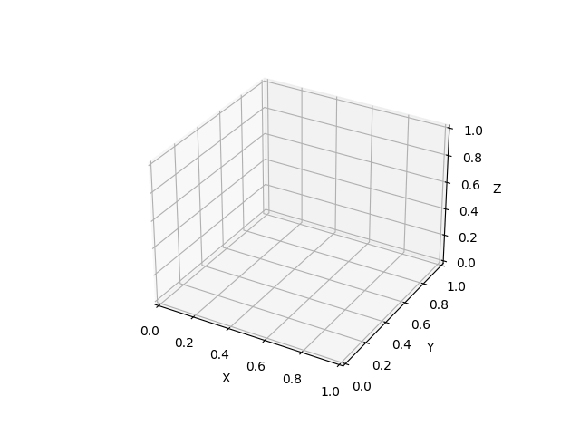
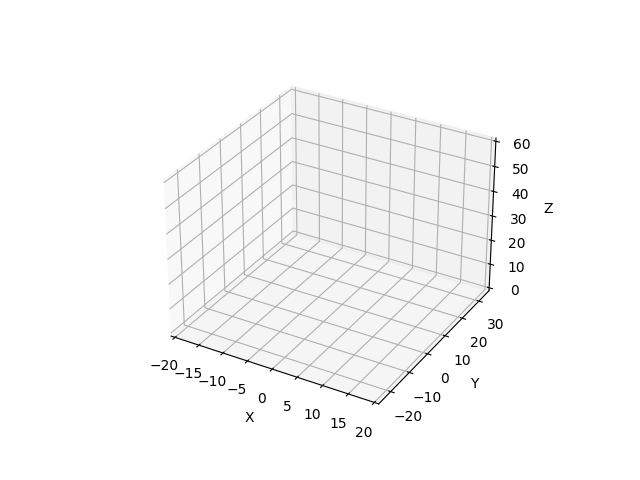
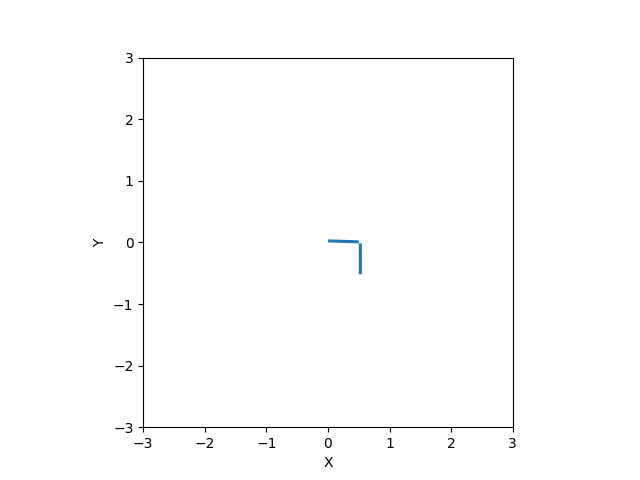

# sys_anim
A collection of animated visualizations (mostly, for the moment, of physical systems) using Matplotlib. 

## What is this for?
The idea is to have something simple to refer to when I need to make something that looks nice. Therefore, I plan to put some effort into the visual aspects of the animations and code readability. But I probably won't put much effort into making this a cohesive package with a nice CLI interface - the code itself is the resource here.

## Known Problems
- Generating GIFs seems to be slower than real time.

# Algorithm Visualizations
## Random Walk

## Optical Flow
(GIF available, but omitted because it's 100MB and I wouldn't play you like that)

# Physical Systems
## Lorenz System

## Double Pendulum System
